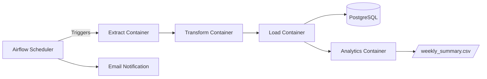

# Airflow ETL Pipeline: Scalable Data Engineering

## Overview

This project demonstrates a scalable, modular ETL (Extract, Transform, Load) pipeline orchestrated with Apache Airflow and Docker. It automates daily data extraction from a REST API, transformation and cleaning with Pandas, loading into PostgreSQL, and analytics/reporting—all in a reproducible, containerized environment.

- **Technologies:** Airflow, Docker, Python, Pandas, SQLAlchemy, PostgreSQL
- **Key Features:**
  - Automated daily ETL workflow
  - Containerized tasks for consistency and portability
  - Modular Python scripts for each ETL stage
  - Analytics and notification integration
  - Easily extensible and production-ready structure

---

## Architecture



- **Airflow** orchestrates the pipeline using a DAG with DockerOperator tasks
- **Docker** containers run each ETL stage in isolation
- **PostgreSQL** stores the cleaned and transformed data
- **Email notifications** alert on pipeline completion

---

## File Structure

```text
pipeline_project/
├─ dags/
│  └─ daily_etl_pipeline_docker.py
├─ etl_scripts/
│  ├─ extract.py
│  ├─ transform.py
│  ├─ load.py
│  └─ analytics.py
├─ docs/
│  └─ scalable-pipelines.md
├─ docker-compose.yml
├─ Dockerfile
├─ requirements.txt
└─ README.md
```

---

## Quickstart

1. **Clone the repository:**
   ```sh
   git clone https://github.com/grant-mueller/airflow-etl-pipeline.git
   cd airflow-etl-pipeline
   ```

2. **Build & start the services:**
   ```sh
   docker-compose up --build
   ```

3. **Initialize Airflow DB & create an admin user:**
   ```sh
   docker-compose exec airflow airflow db init
   docker-compose exec airflow airflow users create \
     --username admin --password admin --firstname Admin --lastname User \
     --role Admin --email admin@example.com
   ```

4. **Access the Airflow UI:**
   - Visit [http://localhost:8080](http://localhost:8080)
   - Log in with the credentials above
   - Trigger the `daily_etl_pipeline` DAG or wait for the next scheduled run

5. **Tear down:**
   ```sh
   docker-compose down -v
   ```

---

## How It Works

- **Extract:** Pulls paginated JSON data from a REST API and saves as CSV
- **Transform:** Cleans and normalizes the data using Pandas
- **Load:** Loads the cleaned data into PostgreSQL using SQLAlchemy
- **Analytics:** Runs summary queries and exports results
- **Notify:** Sends an email notification on pipeline completion

Each stage is a separate Python script, run in its own Docker container via Airflow's DockerOperator.

---

## Extending the Pipeline

- Add new ETL stages by creating scripts in `etl_scripts/` and updating the DAG
- Integrate data quality checks or additional analytics
- Use environment variables or secret managers for sensitive credentials
- See `docs/scalable-pipelines.md` for a detailed case study and code walkthrough

---

## License

This project is licensed under the MIT License.
